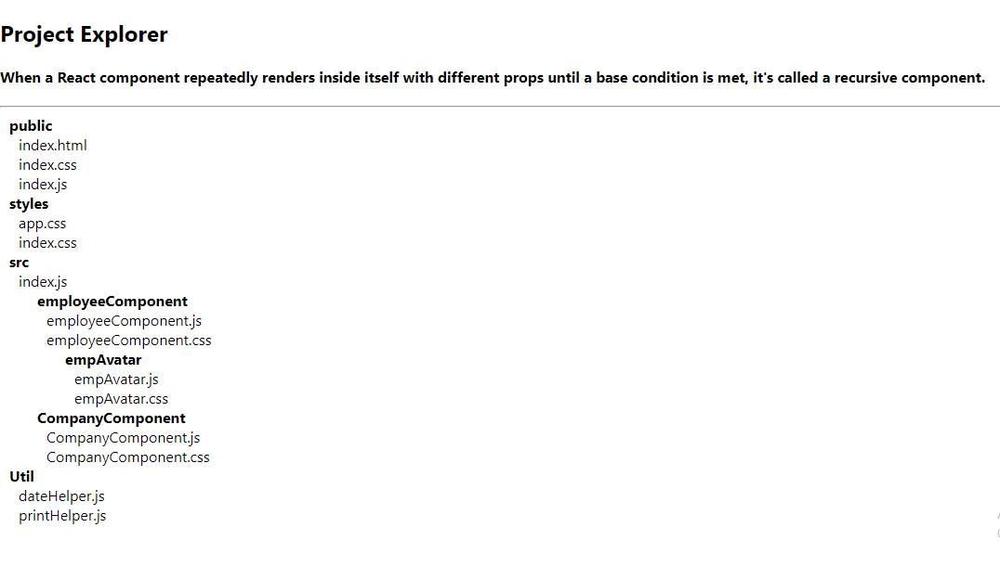

# recursive-react-component

When a React component repeatedly renders inside itself with different props until a base condition is met, it's called a recursive component.

## Live app on stackblitz 
[https://stackblitz.com/edit/react-recursive-component-example?file=src%2FApp.js](https://stackblitz.com/edit/react-recursive-component-example?file=src%2FApp.js)

# Kickstart
1. checkout the repository
2. cd app
3. npm install
4. npm start

## Demo - add new employee

